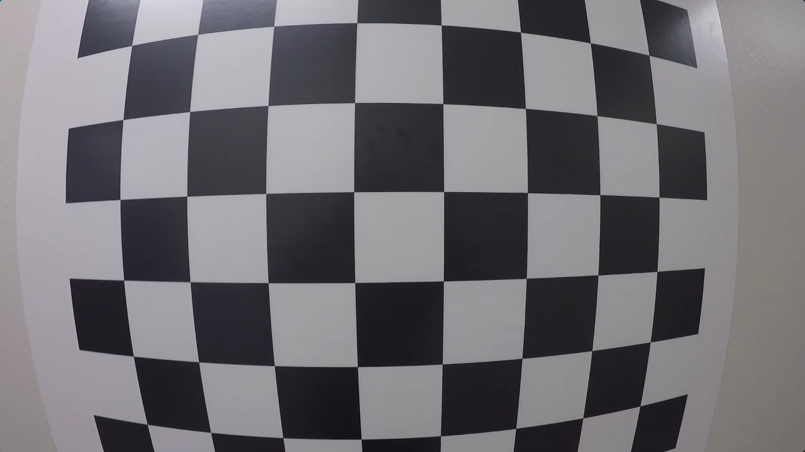
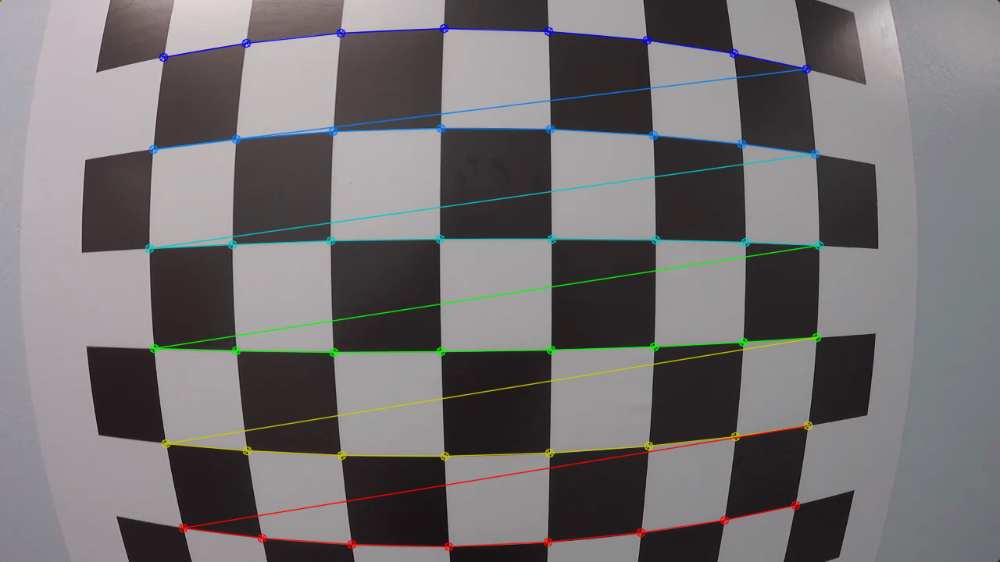
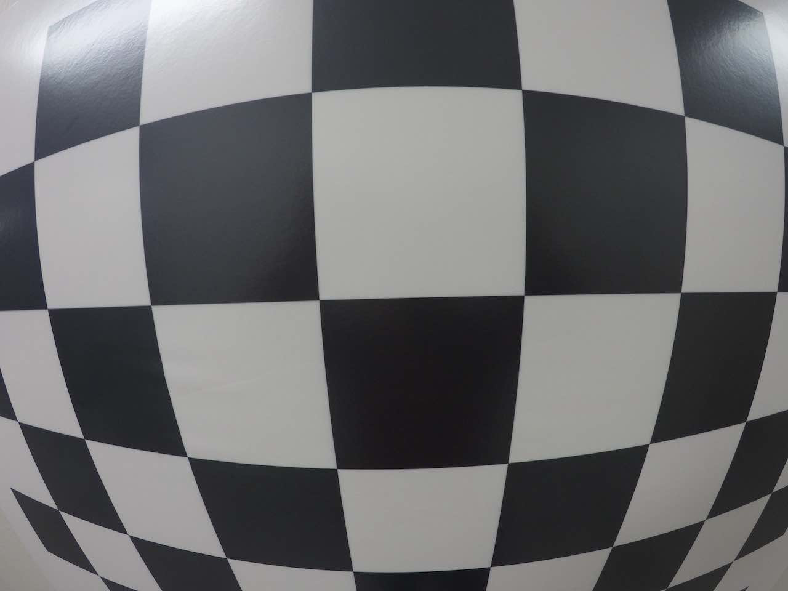
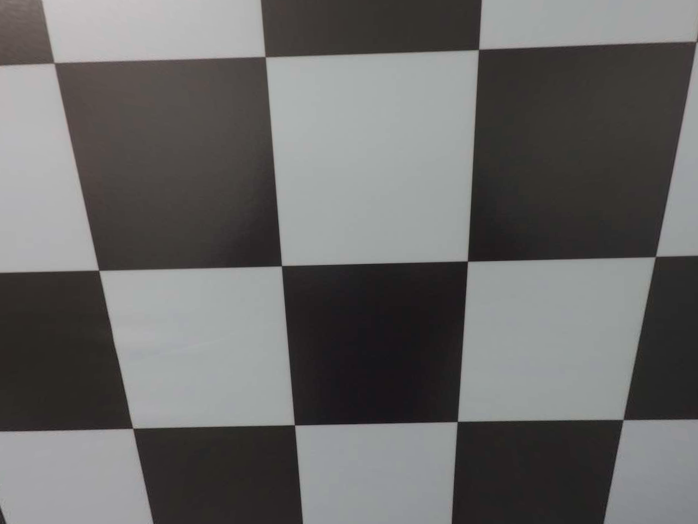
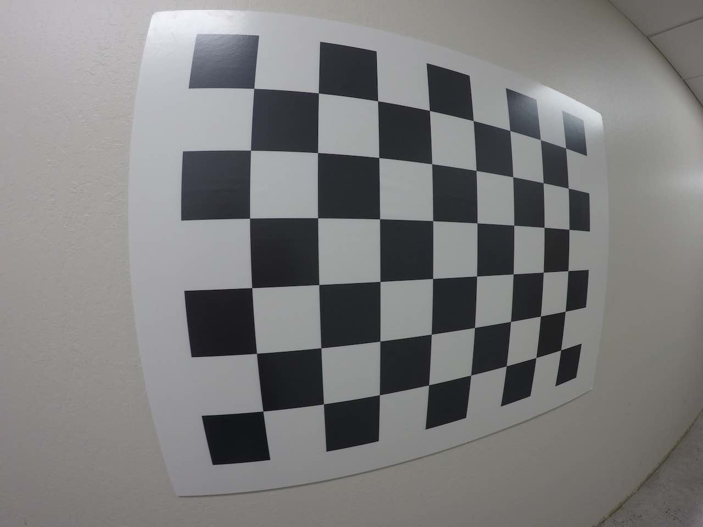
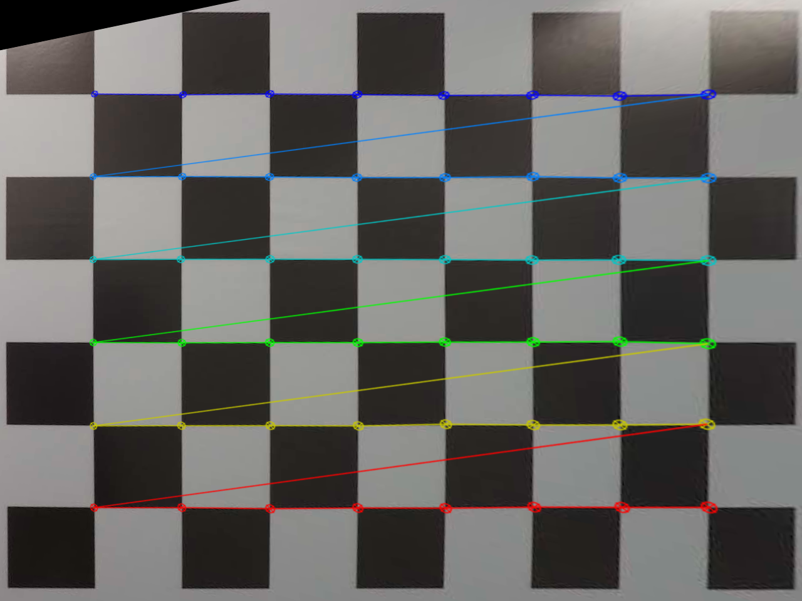

# Udacity_SDC_Nanodegree_Lesson6_CameraCalibration
## Code and Excercices from Lesson 6 of the Udactiy SDC Nanodegree

In this lesson, the basic principles of camera calibration are introduced. This repository contains the Jupyter notebook with my solutions to the quizzes of this lesson.

## 1. Finding corners quiz

This quiz introduces the opencv functions `cv2.findChessboardCorners` and `cv2.drawChessboardCorners` and applies them on a [test Image](./calibration_test.png)

Original image | Image with recognized chessboard corners
:---|:---
 | 

## 2. Correcting for distortion quiz

In this quiz, the functions `cv2.calibrateCamera` and `cv2.undistort` are used to perform the camera calibration and image distortion correction on a [test image](./test_image.png). The object and image points are taken from the file `"wide_dist_pickle_correction_for_distortion.p"`

Original image | Undistorted image
:---|:---
 | 
   
## 3. Camera calibration with OpenCV

The "Camera Calibration with OpenCV" - Section in the notebook reads in a couple of chessboard images taken from [different angles](./calibration_wide/) and returns an undistorted image by determining the object and imagepoints for each calibration image and applying openCVs `cv2.calibrateCamera` and `cv2.undistort` functions to determine the camera matrix and distortion coefficients. 

## 4. Curvature and perspective quiz

In this quiz a perspective transformation is applied on the [test image](./test_image2.png). The functions used include opencv functions such as `cv2.getPerspectiveTransform` and `cv2.warpPerspective`

Original image | Warped and undistorted image
:---|:---
 | 